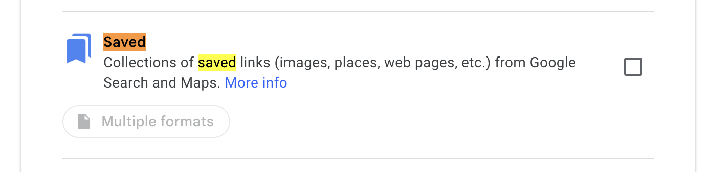

# Google

## TL;DR

### Get your data

Go to Google takeout: https://takeout.google.com/

Ask for a takeout including only the "Saved" data from Google Maps.



Extract the zip file.

### Get a Google API key

After having created a project and enabled the Google Maps API, you need to create an API key.
You can create one under: https://console.cloud.google.com/apis/credentials

### Generate usable data

**BEFORE RUNNING THIS, BE ABSOLUTELY SURE YOU UNDERSTAND THE BORG PRICING MODEL.**

Run the following command:

```bash
GOOGLE_API_KEY=XXXXXXXX go run ./cmd/thota takeout --source path-to-extracted-takeout-folder/Saved > takeaway.json
``` 

The resulting `takeaway.json` file will contain all the necessary information in an interchange format
that can then be used to build importable dataset for other maps applications.

### Caveats

- "dropped pins" are not supported and will be ignored
- places that have been deleted will be ignored

### Nasty details

1. Google lists can sport a user-provided "description".
When there is one, it is stuffed on the first lines of the CSV file, effectively making it a CSV header and breaking
most parsers.
2. Google Takeout exported URL uses `data=!4m2!3m1!1s` to encode the place ID, which is not documented
and not usable in the modern Google Maps API.
The legacy Google Maps API must thus be used to retrieve the place information.
3. Google Takeout also exports other types of "saved" data that are not related to maps lists.
Such records will be ignored.